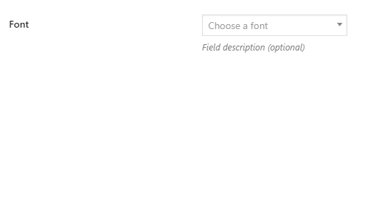

CMB2 Field Type: Font
==================

Custom field for [CMB2](https://github.com/CMB2/CMB2) to allow pick a Google font.



## Examples

```php
add_action( 'cmb2_admin_init', 'cmb2_font_metabox' );
function cmb2_font_metabox() {

	$prefix = 'your_prefix_demo_';

	$cmb_demo = new_cmb2_box( array(
		'id'            => $prefix . 'metabox',
		'title'         => __( 'Font Metabox', 'cmb2' ),
		'object_types'  => array( 'page', 'post' ), // Post type
	) );

	$cmb_demo->add_field( array(
		'name'          => __( 'Font', 'cmb2' ),
		'desc'          => __( 'Field description (optional)', 'cmb2' ),
		'id'            => $prefix . 'font',
		'type'          => 'font',
		'attributes'    => array(
		    'data-placeholder' => __( 'Choose a font', 'cmb2' ),
		)
	) );

}
```

## Retrieve the field value

```php
    $font = get_post_meta( get_the_ID(), 'your_field_id', false );
    
    echo '<style>
        @import url("https://fonts.googleapis.com/css?family=' . str_replace( ' ', '+', $font ) . '");
        body {
            font-family: "' . $font . '";
        }
    </style>'
```

## Changelog

### 1.0.0
* Initial commit